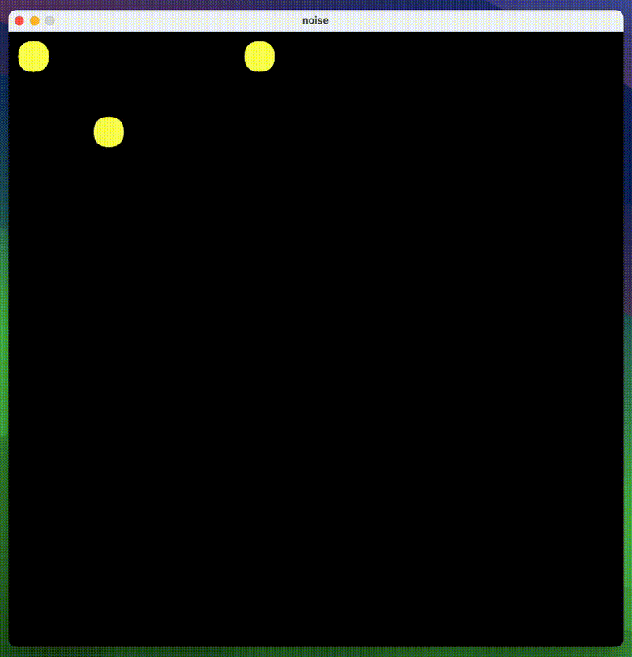

# Internet Background Noise

This is a Processing sketch to visualize the [internet background noise](https://en.wikipedia.org/wiki/Internet_background_noise). The animation shows in real time packets reaching all TCP or UDP ports on a given network interface of a remote server or router. It sets up a black canvas with yellow LEDs in a 16x16 grid where each LED represents an interval of 256 ports.

To receive information about which ports the server has received packets to, the sketch establishes a connection to `ncat` on the server which launches a script watching for packets and replying with the port number. The script runs `tcpdump` to print metadata about packets matching the given network interface and public IP as a destination address.

Once a port number is received, the sketch blinks the corresponding LED for about one second.

## Example

## Usage

On the server, install tcpdump and ncat. Upload the `stream.sh` script, make it executable and customize the `$dev`, `$ip_addr` and `$proto` variables. Then, as root, run `ncat -l 192.168.27.6 1234 -c ./stream.sh --keep-open`, substituting `192.168.27.6` and `1234` with the address and port you want ncat to bind to. Update the same information in the `host` and `port` variables in `node.pde`.

Ideally, ncat should bind to a private address from a local network or VPN since it will be privileged and not authenticated. Having ncat bind to a public address also means that a LED will constantly blink for the ncat port, however if you want to you can add space-separated ports to an exclusion list in the `excluded_ports=()` array.

Now open the project folder with Processing and click the play button to run the sketch! By default it runs in fullscreen but you run in a window by changing `fullScreen()` to `size(width, height)` in pixels.

## Notes

You may optionally run ncat in a screen session so it stays alive when you logout. Since tcpdump captures packets as they reach the NIC, before any firewall, you don't need to open any port for it to work, other than the ncat port. The activity you will see depends on how targeted by bots is the server. You can emphasize the effect by port scanning it, example: `nmap -n -v -p 1-65535 192.0.2.6`.
